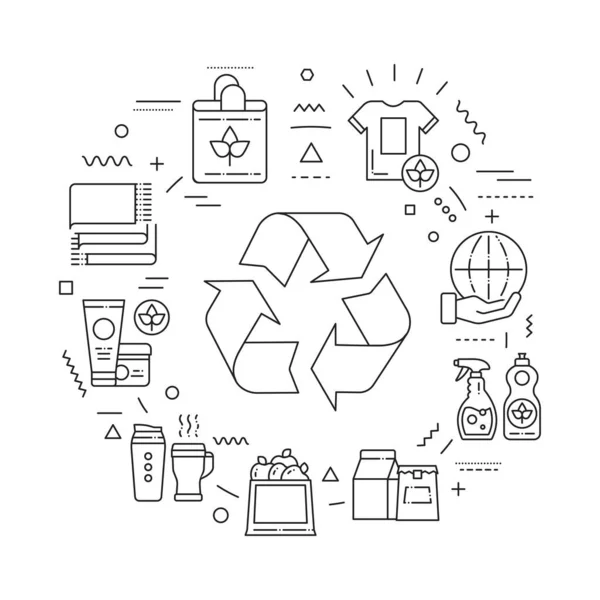

# Economía Circular

### ¿Qué es la economía circular?

Es un modelo que busca minimizar residuos, reutilizando recursos y prolongando la vida útil de productos.

En la práctica, implica reducir los residuos al mínimo. Cuando un producto llega al final de su vida, sus materiales se mantienen dentro de la economía siempre que sea posible gracias al reciclaje. Estos pueden ser productivamente utilizados una y otra vez, creando así un valor adicional. Esto contrasta con el modelo económico lineal tradicional, basado principalmente en el concepto “usar y tirar”.

### Origen
El término "economía circular" se utilizó por primera vez en la literatura occidental en 1980 (Pearce y Turner 1990) para describir un sistema cerrado de las interacciones entre economía y medio ambiente.

### Beneficios
- Proteger el medio ambiente
- Reducir la dependencia de las materias primas
- Crear empleo y ahorrar dinero a los consumidores
