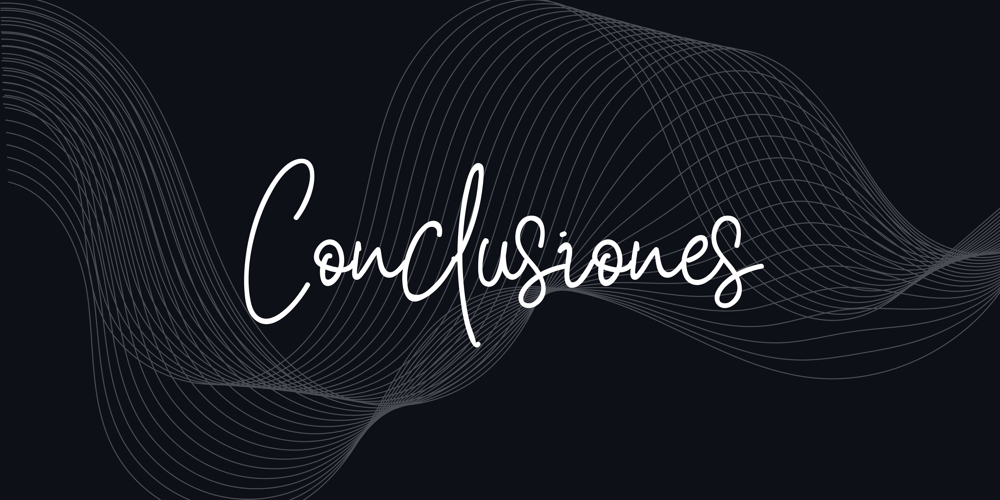

En resumen, la economía circular es un modelo transformacional que mejora el uso de los recursos, reduce los residuos y promueve la sostenibilidad ambiental y económica.
A través de estrategias como la reutilización, el reciclaje y el diseño regenerativo, se promoverá un sistema económico más resiliente y equitativo, capaz de adaptarse a los desafíos globales actuales.
Adoptar este enfoque no sólo es bueno para el medio ambiente, sino que también promueve la innovación, la creación de empleo y la eficiencia de los recursos, allanando el camino para un futuro más sostenible y próspero para todos.
