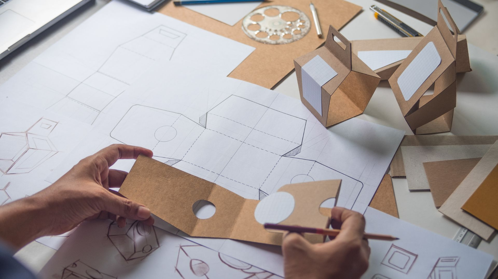

# ¿Qué es el ecodiseño?

Es una filosofía aplicada en la creación de productos, servicios y sistemas, que busca reducir su impacto ambiental a lo largo de toda su vida útil. Esto incluye desde la elección de los materiales y la producción, hasta su uso y finalmente su desecho. 

# ¿Por qué es importante el ecodiseño?

En una era donde la preocupación por el medio ambiente está en constante crecimiento, el ecodiseño se presenta como una solución innovadora y necesaria. Nos permite no solo reducir el daño que causamos al planeta, sino también crear una economía más circular y sostenible. 

# Estrategias sostenibles
1. Prácticas sostenibles en la cadena de suministro: Seleccionar proveedores con compromiso ambiental, priorizando locales y de proximidad.

2. Reducción de recursos y energía: Optimizar el uso de agua y energía para disminuir el impacto ambiental y reducir costos.

3. Adopción de tecnologías verdes: Implementar sistemas de energía renovable y procesos que minimicen la huella de carbono.

4. Economía circular: Reutilizar materiales y gestionar recursos eficientemente para minimizar residuos.

5. Productos y servicios sostenibles: Diseñar bienes que reduzcan el impacto ambiental durante su ciclo de vida y satisfagan necesidades del consumidor.

6. Criterios ESG (Ambientales, Sociales y de Gobernanza): Integrar estos factores para asegurar la generación de valor a largo plazo.

7. Alianzas estratégicas: Colaborar con otras empresas sostenibles para compartir prácticas, desarrollar proyectos y fomentar el crecimiento conjunto.

### La obsolescencia programada.

Fabricación de productos con una vida útil limitada para fomentar el reemplazo frecuente.

