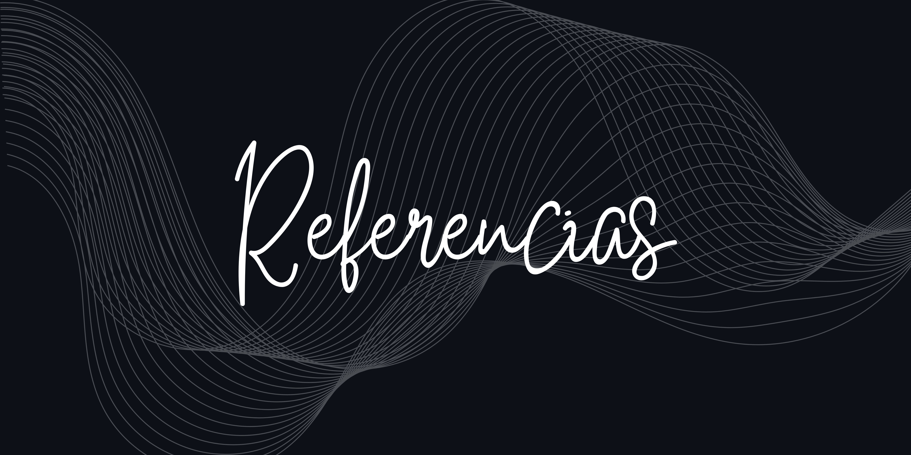

1. [Miteco](https://www.miteco.gob.es/es/calidad-y-evaluacion-ambiental/temas/economia-circular.html)
2. [Modelos de producción actuales y consumismo](https://www.un.org/sustainabledevelopment/es/sustainable-consumption-production/)
3. [Unep](https://www.unep.org/es/regiones/america-latina-y-el-caribe/iniciativas-regionales/promoviendo-la-eficiencia-de-recursos-1)
4. [Munich business school](https://www.munich-business-school.de/es/l/diccionario-de-estudios-empresariales/ciclo-de-vida-del-producto)
5. [Cámara de comercio de España](https://www.camara.es/innovacion-y-competitividad/como-innovar/diseno-sostenible)
