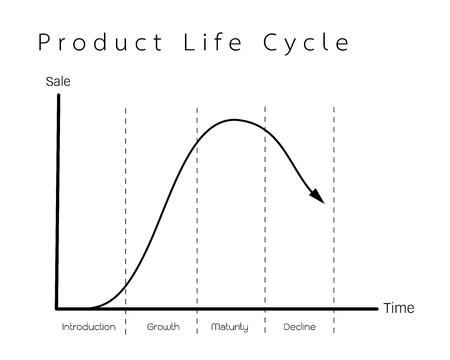

# Ciclo de vida de un producto
Se utiliza para dividir la vida de un producto de principio a fin. En la primera etapa, el producto es ideado por primera vez.

### Etapas
1. Etapa de desarrollo: Se investiga el mercado, se evalúan capacidades internas y se diseñan productos para satisfacer necesidades  dentificadas. Incluye pruebas y ajustes según comentarios previos al lanzamiento.

2. Etapa de crecimiento: El producto gana popularidad, aumentando ventas y competencia. Se refuerzan estrategias de marketing y se ajustan características basadas en el feedback de los clientes.

3. Etapa de madurez: El mercado se satura y las ventas se estabilizan. Se enfrenta mayor competencia y se adoptan estrategias como la agrupación de productos para mantener el interés.

4. Etapa de declive: Las ventas disminuyen debido a costos altos, cambios en el comportamiento del consumidor y la entrada de productos superiores. Se observa una caída en la cuota de mercado.

### La huella ecológica.

Indicador que mide el impacto humano en el planeta según el uso de recursos y generación de residuos.
